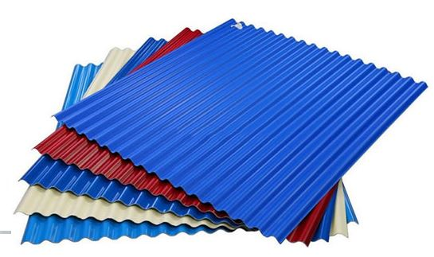

## UNIVERSIDAD CATÓLICA BOLIVIANA "SAN PABLO"
{width=50%}
---
## ESTUDIANTE: GABY NINA
{width=30%}
---
## **ANÁLISIS DE DATOS - VALOR DEL INVENTARIO**
## Análisis del Valor del Inventario de la Empresa de Aceros Galvanizados ACERGAL SRL.
La Empresa de Aceros Galvanizados ACERGAL SRL, desarrolla sus actividades entorno a la producción y comercialización de productos elaborados en base a Aceros Galvanizados, tales como: Calaminas Ensambles, y Perfiles para construcción.
Dentro de el Almacén de Productos terminados se cuenta con un stock variado en cuanto cantidades, según cada uno de los item que permite la identificación de los productos, de los cuales se realizara el análisis.

---
{width=30%}
---

## Artículos Científicos 
Son artículos cientificos que permiten el apoyo a la realizacion del analisis de los datos del stock en Almacenes de Acergal Srl.

### [Modelos y Métodos para la Planificación de la Producción de la Cadena de Suministro bajo Incertidumbre: Una introducción al Estado del Arte.](JM Bru, RP Escoto, FCL Esteban - II Conferencia de Ingeniería de …, 2002 - adingor.es)
### [Modelo de gestión de inventarios: conteo cíclico por análisis ABC](SO Aarón, JWP Vargas - Ingeniare, 2013 - revistas.unilibre.edu.co)
### [Análisis y propuesta de implementación de pronósticos, gestión de inventarios y almacenes en una comercializadora de vidrios y aluminios](KV Ramos Menéndez, EM Flores Aliaga - 2013 - tesis.pucp.edu.pe)

## Libro de Apoyo
### [**Gestión de inventarios. COML0210**](AC Fernández - 2018 - books.google.com)

## Datos del Valor del Inventario
```{r}
library(readxl)
datos <- read_excel("datos.xlsx")
head(datos[1:5])
```
~~~
Donde los datos que se describe son:
  - Código de Ítem
  - Descripción de Producto
  - Cantidad Zofra (Valor de Inventario de Almacenes de Zona Franca El Alto - ZOFRA)
  - Cantidad Nery (Valor de Inventario de Almacenes de Nery El Alto - NERY)
  - Cantidad Calacoto (Valor de Inventario de Almacenes de Zona Calacoto La Paz - CALACOTO)
~~~

- #### DESCRIPCION DEL PRODUCTO

    El analisis se realiza de la cantidad de producto, que en este caso son las Calaminas, producidas a partir del   acero galvanizados, ne distintas formas, tales como: Teja American, Teja Española, Teja Andina, Trapezoidal XL,      Trapezoidal, Ondulada y Planas.
    
{width=40%}

## Análisis de Datos
```{r, echo=FALSE}
summary(datos)
```

## Gráficos del Valor del Inventario

```{r, echo=FALSE}
plot(datos[3:5])
```

## HISTOGRAMAS

```{r, echo=FALSE}
par(bty="l", bg="aliceblue", family="serif" )
hist(datos$`CANTIDAD ZOFRA`, main = "Histograma del Stock en Zofra", col="red")
```


*El histograma refleja el stock que presenta el Almacen de Zofra, y como se puede ver una gran cantidad de items se encuentra entre la cantidad de 0 a 5000 unidades (hojas de calamina), eso debido a que en el mismo lugar se encuentra la Planta de Producción*

```{r, echo=FALSE}

par(bty="l", bg="aliceblue", family="serif" )
hist(datos$`CANTIDAD NERY`, main = "Histograma del Stock en Nery", col="green")

```

*El histograma refleja el stock que presenta el Almacen de Nery,Unidad Comercializadora y como se puede ver una gran cantidad de items se encuentra entre la cantidad de 0 a 500 unidades (hojas de calamina), observandose tambien que existe valores negativos, eso debido a la falta de actualización de datos en sistema de inventaros por traspaso de material*

```{r, echo=FALSE}

par(bty="l", bg="aliceblue", family="serif" )
hist(datos$`CANTIDAD CALACOTO`, main = "Histograma del Stock en Calacoto", col="blue")

```

*El histograma refleja el stock que presenta el Almacen de Calacoto,Unidad Comercializadora y como se puede ver una gran cantidad de items se encuentra entre la cantidad de 0 a 500 unidades (hojas de calamina)*

## DENSIDAD
```{r, echo=FALSE}

par(mfrow=c(2,2), bg="aliceblue", family="serif" )
plot(datos$`CANTIDAD ZOFRA`, main = "Densidad Cantidad Zofra", col="red")

plot(datos$`CANTIDAD NERY`, main = "Densidad Cantidad Nery", col="green")

plot(datos$`CANTIDAD CALACOTO`, main = "Densidad Cantidad Calacoto", col="blue")
```

## CUANTILES
```{r, echo=FALSE}

par(mfrow=c(2,2), bg="aliceblue", family="serif" )
plot(quantile(datos$`CANTIDAD ZOFRA`,c(0.25,0.50,0.75), main = "Densidad Cantidad Zofra", col="red"))

plot(quantile(datos$`CANTIDAD NERY`,c(0.25,0.50,0.75), main = "Densidad Cantidad Nery", col="green"))

plot(quantile(datos$`CANTIDAD CALACOTO`,c(0.25,0.50,0.75), main = "Densidad Cantidad Calacoto", col="blue"))
```

## DIAGRAMA DE CAJAS

```{r, echo=FALSE}

boxplot (datos[3:5])
```

*El diagrama de cajas, muestra los valores estadisticos, de la media, y los cuartiles,en cuanto al Stock que se tiene en cada uno d elos Almacenes, generandose la distribución de los datos y os valores que salen de una distribución normal*

## MATRIZ DE COVARIANZA

```{r, echo=FALSE}
cor(datos[3:5])

library(corrplot)

datos <- cor (datos[3:5],method= "pearson")

corrplot(datos)
```

*El analisis de correlacion realizado de los datos presentes, muestra que no existe relacion entre el valor del inventario de cada uno de los almacenes con otros, mas que con ellos mismos*


```{r, echo=FALSE}
which(is.na(datos[3:5]))
```

*Dentro de las Filas de Datos, no se encuentran valores N/A, valores ausentes*

```{r, echo=FALSE}
scaledatos= scale(datos[3:5])

acp = prcomp(scaledatos)

acp

summary(acp)

desv_stand = acp[[1]]

desv_stand
```

*Se realiza el calculo de la desviación estandar, para conocer la dispersión de los datos respecto a la media*

```{r, echo=FALSE}
varianza = desv_stand^2

varianza

```

*Se realiza el calculo de la varianza, que es una medida de dispersión que representa la variabilidad de una serie de datos respecto a su media*

```{r, echo=FALSE}

CP1= acp[[2]][1]
CP1

CP2= acp[[2]][2]
CP2

CP3= acp[[2]][3]
CP3

Comp_prin = cbind(CP1,CP2,CP3)
Comp_prin
```

*Realizando el calculo de los componenetes principales de acuerdo a la magnitud, son representativos los datos del Componete 1 (CP1) y Componete 3 (CP3)*

## REFERENCIAS BIBLIOGRAFICAS
### [Markdown - La guía definitiva en español](https://markdown.es/)
### [RPubs](https://rpubs.com/)


